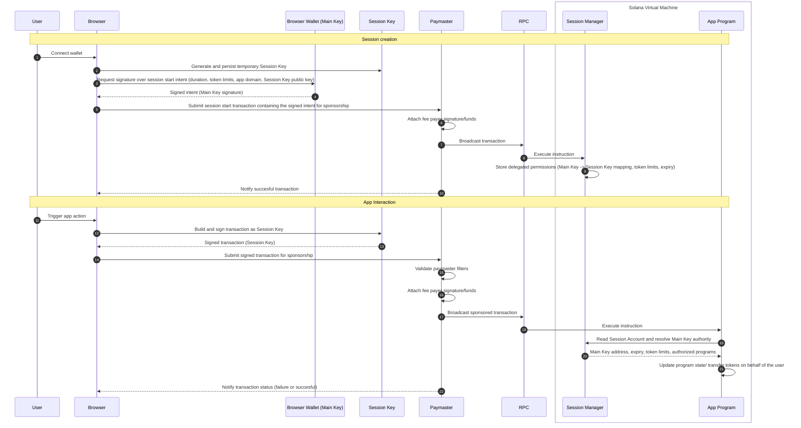

# Fogo Sessions

## Session keys

The core idea behind Fogo Sessions is allowing the user to delegate their permissions within an app to a temporary keypair (Session Key) that's stored in their browser and can sign transactions on behalf of them from that point onwards, therefore removing the need for more browser wallet popups.

When the user first signs in by connecting their browser wallet, they are prompted to sign with their Main Key a human-readable intent message that contains the parameters of the session like duration and token limits. This message is consumed by the Session Manager, an on-chain program, which stores the data about the session (including which Main key has delegated its permissions to the session) in the Session Account whose address is the public key of the Session Key.

Now, whenever an on-chain program receives a transaction signed by the Session Key, it can query the Session Account, read the Main Key's public key and give the transaction access to whatever the Main Key has access within that program.

## The Paymaster Server

One consequence of the session keys design from the section above is that the Main Key doesn't sign any transactions in a users interaction with an app, therefore its funds can't be used to pay for gas. 

To get around this limitation and make gasless the default experience on Fogo, we introduced the paymaster server. This is a gas relay service ran by Douro Labs as a public good for Fogo teams. Whenever a user wants to submit a transaction, instead of sending it to one of the blockchain's RPC nodes directly, it submits it to the paymaster API which will attach some gas to the transaction and broadcast it to the blockchain.

Each app team is responsible for their own segregated paymaster wallet and expected to top it up. To avoid an app's paymaster wallet funding transactions unrelated to their app, they are also responsible for specifying which transactions their paymaster wallet will accept to fund (paymaster filters).

## Sequence diagram

